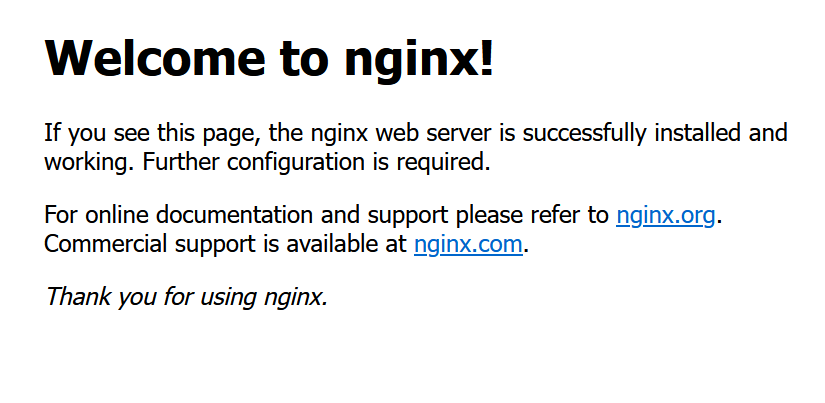

# Web Stack Implementation (Lemp Stack)

## What is a LEMP Stack?

The Ubuntu LEMP stack serves as a substitute for the original [LAMP Stack](https://en.wikipedia.org/wiki/LAMP_%28software_bundle%29). Both stacks consist of the Linux operating system, a web server, a database, and a programming/scripting language. Both stacks allow users to host web applications and implement a fully-functional programming environment. Additionally, the main components of both the LAMP and LEMP stacks can be installed using the default Ubuntu software repository.

The original LAMP Stack includes Linux, [Apache](https://httpd.apache.org/docs/2.4/), [MySQL](https://dev.mysql.com/), and [PHP](https://www.php.net/). The Ubuntu LEMP stack alternative continues to use Linux and PHP, but it includes the [NGINX](https://docs.nginx.com/nginx/admin-guide/web-server/) web server instead of Apache. In most cases, a LEMP stack uses the [MariaDB](https://mariadb.org/) database, although MySQL can also be used.

## Before You Begin 🚀

1. In order to complete this tutorial, you will need to have an Ubuntu 22.04 server with a non-root sudo-enabled user account and a basic security group configuration. This can be configured using our [AWS account setup and Provisioning an Ubuntu Server](https://www.youtube.com/watch?v=xxKuB9kJoYM&list=PLtPuNR8I4TvkwU7Zu0l0G_uwtSUXLckvh&index=6) 

2. Follow our guide on how to access your EC2 Instance [Connecting to your EC2 Instance](https://www.youtube.com/watch?v=TxT6PNJts-s&list=PLtPuNR8I4TvkwU7Zu0l0G_uwtSUXLckvh&index=7)

3. You must have completed projects 1 - 3 Linux, Git, and LAMP.

This guide explains how to install and configure a LEMP stack on Ubuntu 22.04 LTS. It also provides some background about the LEMP stack and how it contrasts with a LAMP stack. Therefore, at the end of this exercise you have a thorough understanding of LAMP & LEMP Stacks and how they differ from each other.

### How to Install LEMP Stack on Ubuntu

This section explains how to install and configure the LEMP Stack on Ubuntu 22.04 LTS. The various LEMP stack components can be installed using the ``apt`` utility. To install the LEMP stack, follow these steps. In all cases, enter ``y`` to proceed with the installation when Ubuntu asks for confirmation.

1. Use ``apt`` to update the Ubuntu packages.

```
sudo apt update && sudo apt upgrade
```

2. Install the NGINX server.

```
sudo apt install nginx
```

3. Confirm NGINX is properly running using the ``systemctl`` utility.

```
sudo systemctl status nginx
```
---
**``output``**
---
```
nginx.service - A high performance web server and a reverse proxy server
     Loaded: loaded (/lib/systemd/system/nginx.service; enabled; vendor preset: enabled)
     Active: active (running) since Wed 2023-09-20 11:00:50 UTC; 14s ago
       Docs: man:nginx(8)
```

4. Install the MariaDB database

```
sudo apt install mariadb-server
```

5. Install the PHP module for MariaDB/MySQL support

```
sudo apt install php-mysql
```

6. Install the PHP FastCGI Processing Manager. This includes all the PHP packets necessary for NGINX support, along with other core dependencies

```
sudo apt install php-fpm
```

7. (Optional) Other applications, including WordPress, require additional PHP components. The following optional packages are frequently helpful

```
sudo apt install php-curl php-gd php-mbstring php-xml php-xmlrpc
```

### How to Configure a LEMP Stack on Ubuntu

At this point, all LEMP Stack components are installed, but the stack is not yet ready to use. The individual elements must be configured or enabled. Each component can immediately be configured after installation, but it’s usually easier to install all the applications first and configure them later.

### Configuring the NGINX Web Server and Creating a Site Configuration File

NGINX is easier to configure than some other web servers. However, the firewall settings must be configured to allow web access through both HTTP and HTTPS. Additionally, creating a site configuration file in NGINX is highly recommended, even if only one site is hosted on the server. If multiple sites are being hosted, a site configuration file is mandatory. To finish setting up NGINX, follow these steps

1. **Access the EC2 Dashboard:**
   Once logged in, navigate to the EC2 Dashboard. You can do this by either searching for "EC2" in the AWS services search bar or by finding "EC2" under "Compute" in the AWS services list.

2. **Select the Appropriate Security Group:**
   In the EC2 Dashboard, select the instance for which you want to open port 80. Under the "Description" tab, find the "Security groups" section, and click on the security group associated with your instance. This will take you to the Security Group page.

3. **Edit the Security Group Inbound Rules:**
   On the Security Group page, navigate to the "Inbound rules" tab. This is where you can configure the rules to allow incoming traffic.

4. **Add a Rule for Port 80 & 443 (HTTP & HTTPS):**
   To open port 80 & 443 for HTTP traffic, click the "Edit inbound rules" button. Then, click the "Add rule" button to add a new rule. Configure the rule as follows:
   - **Type:** HTTP (80)
   - **Source:** You can specify the source IP range or leave it as 0.0.0.0/0 to allow traffic from any IP address.

   Repeat the above steps to add HTTPS (443)

6. **Review and Save the Rule:**
   Double-check your rule settings to ensure they are correct. Once you are satisfied, click the "Save rules" or "Save" button to apply the changes.

7. **Confirm the Rule:**
   After saving, the rule will be added to your security group. Make sure that it's properly configured and that the inbound rule for port 80 (HTTP) is present.

***With these steps completed, you have opened port 80 for HTTP traffic in your AWS Security Group, allowing incoming web traffic to reach your Apache EC2 Instance.***

After configuring the security group, ensure NGINX allows web access. Using a browser, visit the Public IP address of the web server. The site displays the default NGINX welcome page. 


