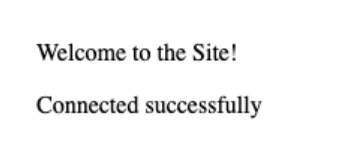

# Web Stack Implementation (Lemp Stack)

## What is a LEMP Stack?

The Ubuntu LEMP stack serves as a substitute for the original [LAMP Stack](https://en.wikipedia.org/wiki/LAMP_%28software_bundle%29). Both stacks consist of the Linux operating system, a web server, a database, and a programming/scripting language. Both stacks allow users to host web applications and implement a fully-functional programming environment. Additionally, the main components of both the LAMP and LEMP stacks can be installed using the default Ubuntu software repository.

The original LAMP Stack includes Linux, [Apache](https://httpd.apache.org/docs/2.4/), [MySQL](https://dev.mysql.com/), and [PHP](https://www.php.net/). The Ubuntu LEMP stack alternative continues to use Linux and PHP, but it includes the [NGINX](https://docs.nginx.com/nginx/admin-guide/web-server/) web server instead of Apache. In most cases, a LEMP stack uses the [MariaDB](https://mariadb.org/) database, although MySQL can also be used.

## Before You Begin 🚀

1. In order to complete this tutorial, you will need to have an Ubuntu 22.04 server with a non-root sudo-enabled user account and a basic security group configuration. This can be configured using our [AWS account setup and Provisioning an Ubuntu Server](https://www.youtube.com/watch?v=xxKuB9kJoYM&list=PLtPuNR8I4TvkwU7Zu0l0G_uwtSUXLckvh&index=6) 

2. Follow our guide on how to access your EC2 Instance [Connecting to your EC2 Instance](https://www.youtube.com/watch?v=TxT6PNJts-s&list=PLtPuNR8I4TvkwU7Zu0l0G_uwtSUXLckvh&index=7)

3. You must have completed projects 1 - 3 Linux, Git, and LAMP.

This guide explains how to install and configure a LEMP stack on Ubuntu 22.04 LTS. It also provides some background about the LEMP stack and how it contrasts with a LAMP stack. Therefore, at the end of this exercise you have a thorough understanding of LAMP & LEMP Stacks and how they differ from each other.

### How to Install LEMP Stack on Ubuntu

This section explains how to install and configure the LEMP Stack on Ubuntu 22.04 LTS. The various LEMP stack components can be installed using the ``apt`` utility. To install the LEMP stack, follow these steps. In all cases, enter ``y`` to proceed with the installation when Ubuntu asks for confirmation.

1. Use ``apt`` to update the Ubuntu packages.

```
sudo apt update && sudo apt upgrade
```

2. Install the NGINX server.

```
sudo apt install nginx
```

3. Confirm NGINX is properly running using the ``systemctl`` utility.

```
sudo systemctl status nginx
```
**``output``**
```
nginx.service - A high performance web server and a reverse proxy server
     Loaded: loaded (/lib/systemd/system/nginx.service; enabled; vendor preset: enabled)
     Active: active (running) since Wed 2023-09-20 11:00:50 UTC; 14s ago
       Docs: man:nginx(8)
```

4. Install the MariaDB database

```
sudo apt install mariadb-server
```

5. Install the PHP module for MariaDB/MySQL support

```
sudo apt install php-mysql
```

6. Install the PHP FastCGI Processing Manager. This includes all the PHP packets necessary for NGINX support, along with other core dependencies

```
sudo apt install php-fpm
```

7. (Optional) Other applications, including WordPress, require additional PHP components. The following optional packages are frequently helpful

```
sudo apt install php-curl php-gd php-mbstring php-xml php-xmlrpc
```

### How to Configure a LEMP Stack on Ubuntu

At this point, all LEMP Stack components are installed, but the stack is not yet ready to use. The individual elements must be configured or enabled. Each component can immediately be configured after installation, but it’s usually easier to install all the applications first and configure them later.

### Configuring Security Group

NGINX is easier to configure than some other web servers. However, the firewall settings must be configured to allow web access through both HTTP and HTTPS. Additionally, creating a site configuration file in NGINX is highly recommended, even if only one site is hosted on the server. If multiple sites are being hosted, a site configuration file is mandatory. To finish setting up NGINX, follow these steps

1. **Access the EC2 Dashboard:**
   Once logged in, navigate to the EC2 Dashboard. You can do this by either searching for "EC2" in the AWS services search bar or by finding "EC2" under "Compute" in the AWS services list.

2. **Select the Appropriate Security Group:**
   In the EC2 Dashboard, select the instance for which you want to open port 80. Under the "Description" tab, find the "Security groups" section, and click on the security group associated with your instance. This will take you to the Security Group page.

3. **Edit the Security Group Inbound Rules:**
   On the Security Group page, navigate to the "Inbound rules" tab. This is where you can configure the rules to allow incoming traffic.

4. **Add a Rule for Port 80 & 443 (HTTP & HTTPS):**
   To open port 80 & 443 for HTTP traffic, click the "Edit inbound rules" button. Then, click the "Add rule" button to add a new rule. Configure the rule as follows:
   - **Type:** HTTP (80)
   - **Source:** You can specify the source IP range or leave it as 0.0.0.0/0 to allow traffic from any IP address.

   Repeat the above steps to add HTTPS (443)

6. **Review and Save the Rule:**
   Double-check your rule settings to ensure they are correct. Once you are satisfied, click the "Save rules" or "Save" button to apply the changes.

7. **Confirm the Rule:**
   After saving, the rule will be added to your security group. Make sure that it's properly configured and that the inbound rule for port 80 (HTTP) is present.

***With these steps completed, you have opened port 80 for HTTP traffic in your AWS Security Group, allowing incoming web traffic to reach your Apache EC2 Instance.***

After configuring the security group, ensure NGINX allows web access. Using a browser, visit the Public IP address of the web server. The site displays the default NGINX welcome page. 


### Configuring the NGINX Web Server and Creating a Site Configuration File

1. Create a root ``public_html`` directory for the site. Create this directory within the /``var/www/html/domain_name`` directory, where ``domain_name`` is the name of the site. In the following command, replace ``example.com`` with the actual name of the domain.

```
sudo mkdir -p /var/www/html/example.com/public_html
```

2. It is simpler to base the site configuration file on the default NGINX welcome page. Copy over the default NGINX configuration file to ``/etc/nginx/sites-available/example.com.conf.`` Replace ``example``.com with the name of the domain. The new configuration file must be named after the domain and have the ``.conf`` extension.

```
sudo cp /etc/nginx/sites-enabled/default /etc/nginx/sites-available/example.com.conf
```

3. Edit the ``.conf`` file for the domain, making the following changes. A line-by-line description is as follows:

- Delete the existing uncommented ``server`` configuration all the way to the line ``Virtual Host configuration for example.com``. Change the name of the comment to reflect the name of the domain. Uncomment the remaining lines. All further changes occur inside the remaining code block beginning with ``server``.

- Leave the ``listen`` configuration in place. These lines tell NGINX to listen for incoming connections on port ``80``.

- Change the value for ``server_name`` to the name of the domain. Enter the domain name with and without the ``www`` prefix so visitors can use either alternative.

- Set ``root`` to the name of the newly-created root directory for the domain. For ``example.com``, this is ``/var/www/html/example.com/public_html``.

- For most sites, the value of ``index`` should be ``index.html``. However, for WordPress and other sites that use PHP, it must be changed to ``index.php``.

- The block starting with ``location /`` should remain unchanged. The ``try_files`` configuration instructs NGINX to verify the requested file actually exists before processing the request. If the file does not exist, NGINX returns a ``404`` error.

- Add a code block for ``location ~* \.php$``. NGINX applies this configuration to all domain files with the ``php`` extension. The ``*`` symbol indicates PHP file names are not case sensitive.

- Change the name of ``fastcgi_pass`` to indicate the socket where PHP should listen to new requests. This is found at ``unix:/run/php/php<release_num>-fpm.sock``, where ``release_num`` is the PHP release number. For instance, if PHP release ``8.1`` is installed, ``fastcgi_pass`` should be ``unix:/run/php/php8.1-fpm.sock``. To determine the PHP release, use the command ``php -v``.

- Set the ``include`` directive to ``snippets/fastcgi-php.conf``. This is the name of the configuration file that handles PHP processing.

- Add a ``location`` block for ``~ /\.ht``. This tells NGINX not to serve any ``.htaccess`` files.

Here is an example of a domain configuration file. Replace ``example.com`` with the name of the actual domain wherever it occurs.

**``File: /etc/nginx/sites-available/example.com.conf``**

```
server {
    listen 80;
    listen [::]:80;

    server_name example.com www.example.com;
    root /var/www/html/example.com/public_html;
    index index.html;

    location / {
        try_files $uri $uri/ =404;
    }

    location ~ \.php$ {
        fastcgi_pass unix:/var/run/php/php8.1-fpm.sock;
        include snippets/fastcgi-php.conf;
    }

    location ~ /\.ht {
        deny all;
    }
}
```

4. To enable the site, create a link to the domain configuration file from the ``sites-enabled`` directory. In the following command, replace ``example.com`` with the name of the domain.

```
sudo ln -s /etc/nginx/sites-available/example.com.conf /etc/nginx/sites-enabled/
```

8. (Optional) For enhanced security, unlink the default site.

```
sudo unlink /etc/nginx/sites-enabled/default
```

9. Validate the changes using the ``nginx -t`` command. If the test command finds any errors, inspect the new file and make any necessary adjustments.

```
sudo nginx -t
```
**``output``**

```
nginx: the configuration file /etc/nginx/nginx.conf syntax is ok
nginx: configuration file /etc/nginx/nginx.conf test is successful
```

### Configuring the MariaDB Database

The MariaDB database is ready to use. However, a new database user has to be created for the web application. It is also important to tighten application security. To finish configuring MariaDB, follow these steps.

1. Log in to the MariaDB shell as the ``root`` user. The application displays the ``MariaDB`` prompt.

```
sudo mysql -u root
```
**``output``**

```
Welcome to the MariaDB monitor.  Commands end with ; or \g.
Your MariaDB connection id is 31
Server version: 10.6.7-MariaDB-2ubuntu1 Ubuntu 22.04
...
MariaDB [(none)]
```

2. Create the ``webdata`` database.

```
CREATE DATABASE webdata;
```

3. Use the ``CREATE USER`` command to add a new “web application” user. Provide a more secure user name and password in place of ``webuser`` and ``password`` in the query.

```
CREATE USER 'webuser' IDENTIFIED BY 'password';
```

4. Grant full rights to the new user. MariaDB should respond with ``Query OK`` after each line. Use the following SQL commands to configure the database.

```
GRANT ALL ON webdata.* TO 'webuser';
```

5. Exit the database shell

```
quit
```

6. Use the built-in [mysql_secure_installation](https://mariadb.com/kb/en/mysql_secure_installation/) tool to increase the security of the database.

```
sudo mysql_secure_installation
```

7. It is not necessary to switch over to Unix socket authentication. It is also not necessary to change the root password, and it is safe to leave this field blank when prompted. However, answer ``Y`` to the following questions:

- ``Remove anonymous users?``
- ``Disallow root login remotely?``
- ``Remove test database and access to it?``
- ``Reload privilege tables now?``

### Testing the LEMP Stack Installation on the Ubuntu Server

In addition to verifying the web server works properly, it is critical to test the virtual host configuration, PHP integration, and the MariaDB database. This is the only way to confirm all components can interact together.

The easiest way to verify an Ubuntu LEMP stack installation is with a short test script. This script must be placed somewhere within the ``DirectoryRoot`` directory.

The PHP test code must initiate a connection to MariaDB using the ``mysqli_connect`` function. Use the username and the password for the account created in the **Configuring the MariaDB Database** section. If the connection is successful, the function returns a ``Connection`` object. The script provides information about the status of the connection attempt along with details about any failures.

To validate the installation, follow these steps:

1. Create a test file named ``phptest.php`` in the ``public_html`` directory for the domain. Set ``servername`` to ``localhost`` and ensure the ``username`` and ``password`` match the authentication details for the MariaDB web user account.

**``File: /var/www/html/example.com/public_html/phptest.php``**

```
<html>
<head>
    <title>PHP Test</title>
</head>
    <body>
    <?php echo '<p>Welcome to the Site!</p>';

    // The servername must be 'localhost'. Use the name and password of the web user account created earlier. Do not use the root password.
    $servername = "localhost";
    $username = "webuser";
    $password = "password";

    // Create MySQL connection
    $conn = mysqli_connect($servername, $username, $password);

    // If the conn variable is empty, the connection has failed. The output for the failure case includes the error message
    if (!$conn) {
        die('<p>Connection failed: </p>' . mysqli_connect_error());
    }
    echo '<p>Connected successfully</p>';
    ?>
</body>
</html>
```

Execute the test script using a web browser. In the address bar, enter the domain name or server IP followed by ``/phptest.php``. In the following example, substitute the actual name of the domain for example.com.

```
http://example.com/phptest.php
```

If everything is installed correctly, the browser should display the text ``Welcome to the Site!`` and ``Connected successfully.`` If you see the ``Connection Failed``: message, review the SQL error information to debug the problem.




